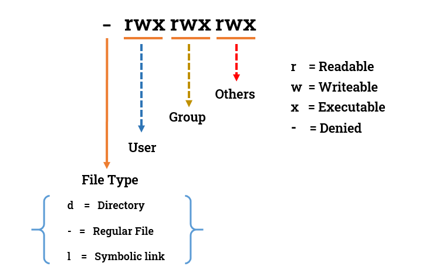
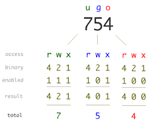

# Instrukcja

Poniżej plan poszczególnych ćwiczeń.

## Nawigacja - pierwsze kroki

Struktura plików na Linuxie, choć koncepcyjnie zbliżona do systemów takich jak Windows, diametralnie się różni. Zapoznaj się z podstawowymi różnicami.

### Windows vs Linux

- Folder = Katalog, koncepcyjnie to samo, różnica w nazwie.
- Wszystkie ścieżki zaczynają się w `/`, niezależnie od tego do którego dysku prowadzą. np. `/mnt/c/users` =  `C:\Users`
- Linux używa forward slashes (`/`) zamiast backslashes (`\`) jak Windows do zapisywania ścieżek. (Przykład wyżej)
- Wszystkie nazwy plików i katalogów są <ins>case-sensitive</ins>, to znaczy, że czymś innym jest np. `Plik` i `plik`
- Na Windowsie, podstawowym terminalem jest CMD (Batch), (powoli zastępuje go PowerShell), na Linuxie podstawowym terminalem jest Bash. Istnieją też jego zamienniki takie jak Zsh czy Fish.

### cd, pwd

Poruszanie się między katalogami realizuje komenda `cd` (identycznie jak w Windowsowym CMD). Jej składnia jest bardzo prosta: `cd {katalog*}`

\* *Na Linuxie są pewne specjalne "katalogi" dające inne sposoby poruszania, np. `~` oznaczające nasz katalog domowy użytkownika, `..` oznaczające wyjdź z tego katalogu czy `-` oznaczające cofnij się do poprzedniego katalogu.*

> Spróbuj przejść do katalogu /etc komendą `cd etc`, w czym tkwi problem? Użyj komendy `cd /etc` i sprawdź czy zadziałała.

Komenda `pwd` pozwala na wypisanie ścieżki katalogu w którym obecnie się znajdujemy.

> Spróbuj użyć komendy `pwd` do wypisania obecnej ścieżki.

### bash, exit

Bash jest podstawowym wierszem poleceń na Linuxie, dzisiaj będziemy się zajmować właśnie nim. Nie będziemy wchodzić w jego szczegóły, o tych opowiemy na następnych warsztatach.

> Spróbuj stworzyć nową sesje wiersza poleceń, wpisz w terminalu komendę `bash`, przejdź do innego katalogu, a następnie wpisz `exit` by zamknąć sesje. Sprawdź obecną ścieżkę komendą `pwd`. Co zauważasz?

## Nawigacja - Zadania

[Ściąga do zadań](cheat_sheet_1.md#nawigacja)

### Zad 1 - /etc nawigacja

Znajdując się w katalogu domowym, wejdź do katalogu /etc, wyświetl ścieżkę, następnie wejdź spowrotem do katalogu domowego i wyświetl ścieżkę.
Komendy: `cd`, `pwd`

### Zad 2 - /usr nawigacja

Wejdź do katalogu /usr, wyświetl ścieżkę, następnie w jednej komendzie wyjdź z niego i wejdź do katalogu /home. Wyświetl ścieżkę.
Komendy: `cd`, `pwd`

## Operacje na plikach

Linux oferuje wiele możliwości operacji na plikach. Zapoznaj się z najważniejszymi
komendami i wykonaj ćwiczenia.

> Jeśli masz problem, pamiętaj o `man` <*nazwa_komendy*>. Znajduję się tam
> kompletna dokumentacja wybranej przez Ciebie komendy.

[Ściąga do zadań](cheat_sheet_1.md#operacje-na-plikach)

### touch, echo

Komenda `echo` służy do wyświetlania linii tekstu. Każdy tekst jest przesyłany do
**standard output**, który następnie przesyłany jest w wybrane miejsce (np. terminal).

> Wyświetl na terminalu napis "**Hello World!**".

Komenda `touch` służy do tworzenia nowych plików (ale nie tylko) z poziomu CLI.

> **Utwórz plik `plik.txt`**

Zauważ, że utworzony plik jest domyślnie pusty.

> Znajdź sposób, w jaki można połączyć komendy `echo` i `touch`, aby utworzyć plik `hello_world.txt` z napisem "**Hello world**" w środku.

Komenda `touch` służy nie tylko do tworzenia nowych plików. Wpisz `man touch` i sprawdź do czego jeszcze można ją wykorzystać.

> Wyświetl informacje o plikach w obecnym directory używając `ls -l`. Jaka data widnieje przy pliku `hello_world.txt`?
>
> Używając `touch` (z odpowiednią flagą) zmień datę ostatniej modyfikacji `hello_world.txt` na pełną datę twoich urodzin (np. "1 January 2003"). Ponownie użyj komendy `ls -l`. Czy data została prawidłowo zmieniona?

### cp

W systemie Linux, `cp` służy do kopiowania plików oraz katalogów. Sprawdź składnię komendy w zakładce **SYNOPSIS**, używając `man cp`.

> Utwórz nowy katalog wpisując `mkdir my_dir`. Skopiuj plik `hello_world.txt` do nowo utworzonego katalogu. Sprawdź czy plik został skopiowany używając komendy `ls my_dir`.

Co w przypadku kiedy potrzebujemy skopiować kilka plików na raz? Używając `man cp` przeczytaj o fladze **-t**.

> Używając `cp` tylko raz skopiuj pliki `plik.txt` i `hello_world.txt` do katalogu `my_dir`. Potwierdź powodzenie operacji komendą `ls`.
>
> Teraz spróbuj skopiować katalog `my_dir` do `my_dir_copy`. Jakiej flagi musisz użyć aby komenda zadziałała? Pamiętaj, że nie musisz wcześniej ręcznie tworzyć `my_dir_copy`. Komenda `cp` automatycznie utworzy docelowy katalog, jeśli takowy nie istnieje.

Na koniec usuń katalog `my_dir_copy` za pomocą komendy `rm -rf my_dir_copy` i raz jeszcze skopiuj `my_dir` do `my_dir_copy`, ale tym razem dodaj też flagę **-v**. Co się dzieje?

### mv

Kolejną komendą której się przyjrzymy jest `mv`. Służy ona do przenoszenia plików i katalogów z jednej lokacji do drugiej. Składnia komendy jest bardzo podobna do `cp`.

> Utwórz nowy katalog komendą `mkdir new_dir`. Przenieś `plik.txt` do nowo utworzonego katalogu. Sprawdź czy plik znajduje się w katalogu, a następnie przenieś plik z powrotem do katalogu domowego.

Załóżmy, że chcemy zmienić nazwę pliku `plik.txt` na `file.txt`. W jaki sposób możemy to zrobić z wykorzystaniem `mv`?

> Zmień nazwę `plik.txt` na `file.txt`.

### rm

Komenda `rm` służy do usuwania plików i katalogów.

> Usuń plik `file.txt`. Następnie spróbuj usunąć katalog `new_dir` używając tej samej komendy. Jaki komunikat pojawia się na konsoli? Poszukaj w `man rm` jakiej flagi należy użyć aby usunąć katalog.

### cat

Czasem potrzebjemy zerknąć na zawartość jakiegoś pliku. Służy do tego komenda `cat`.

> Wykonaj komendę `ls -al > example.txt`. Komenda zapisuje w pliku `example.txt` informacje o plikach w obecnym katalogu.
>
> Teraz wyświetl zawartość `example.txt` z pomocą `cat`.

Komenda `cat` pozwala również wyświetlać zawartość pliku z numeracją linii.

> Sprawdź w `man cat` jaką flagę należy użyć aby wyświetlić plik wraz z numeracją linii i sprawdź jak to wygląda.

## Przetwarzanie potokowe - get piped

Wielką zaletą terminala w Linuxie jest przetwarzanie potokowe. Tłumacząc na ludzki, jest to łączenie ze sobą komend poprzez wzajemne przekazywanie sobie wyników swojej pracy i robienie z nim coś dalej. Na tych warsztatach przyjrzmy się podstawą tego zagadnienia, dalsza jego część będzie realizowana w ramach następnych warsztatów.

"Potok" komend tworzymy poprzez połączenie ich operatorami, tworząc długą linijkę przeplatających się komend i operatorów (`komenda operator komenda` itd.)
Komendy przekazują sobie informacje na wejściu standardowym, wyjściu standardowym i wyjściu błędu (stdin, stdout, stderr).
Zapoznaj się z częścią podstawowych operatorów.

### less

"Przewijający się czytnik". Czytanie bardzo długich plików komendą `cat` może być dość skomplikowane, less pozwala na wyświetlanie tekstu po którym można poruszać się bardzo prosto i intuicyjnie klawiaturą.

> Stwórz jakikolwiek plik z tekstem. Otwórz go komendą `less nazwa_pliku`.

### Operator Pipe `|`

Jeśli połączymy dwie komendy tym operatorem, jedna komenda przekaże drugiej wynik swojej pracy. Można to zrozumieć jako zamontowanie na wyjściu pierwszego programu "rury" kierującej się do wejścia drugiego programu.

> Komenda `journalctl` służy do wyświetlania logów systemowych. Wpisz komendę `journalctl | less` by odczytać je przez czytnik less.

### find

Komenda służąca do szukania plików lub katalogów w systemie. W najbardziej podstawowej formie wymaga podania ścieżki pod którą komenda ma szukać i użycia argumentu `-name` definiującego nazwę (bądź jej część) szukanego pliku/katalogu. Innym użytecznym argumentem jest `-type` do którego można podać m.in "f" (file) lub "d" (directory) oznaczający typ szukanego elementu.

> Spróbuj wyszukać katalog domowy komendą `find / -maxdepth 2 -name home -type d`.

Zauważ wyskakujące błędy spowodowane brakiem uprawnień do przeszukiwania niektórych folderów. W kolejnym rozdziale dowiesz się skąd się biorą i jak ich uniknąć.

> Wprowadź tą samą komendę, ale teraz poprzedź ją słowem `sudo`. Czy błedy dalej występują?

### Operatory std redirect `1>, 2>`

Pozwalają na przekierowanie konkretnego wyjścia/wejścia. Uprzednio poznałeś operator `>` nadpisujący zawartość pliku wyjściem standardowym z komendy. Oznacza on to samo co `1>` (1=stdout). Bardzo użyteczny jest również operator `2>` (2=stderr) działający w ten sam sposób, jednak pozwalający na przekierowanie wyjścia błędów.

Plik `/dev/null` to specjalny plik działający jak czarna dziura na wejście standardowe. 

> Ponownie wykonaj komendę find, jednak tym razem przekierowując jej wyjście błędu do /dev/null, `find / -maxdepth 2 -name home -type d 2> /dev/null`, co obserwujesz?

### grep

Wyszukiwanie w tekście. Najczęściej używane z operatorem pipe. Domyślnie wyciąga z tekstu linijki zawierające wyszukiwany tekst. Można nim wyszukiwać również wyrażenia regularne.

> Spróbuj użyć komendy `journalctl | grep "start"`. Komenda wyrzuciła masę tekstu na wyjściu standardowym, co można zrobić, by łatwiej go było odczytać? Wypróbuj tą samą komendę z opcją grep'a `-i`.

### sed

Strumieniowy edytor tekstu przystosowany do przetwarzania potokowego. Niezwykle potężny (i skomplikowany). Szerzej zajmiemy się nim na następnych warsztatach.

## Przetwarzanie potokowe - Zadania

[Ściąga do zadań](cheat_sheet_1.md#przetwarzanie-potokowe)

### Zad 1 - tworzenie pliku

Stwórz w katalogu `/tmp` plik `laurDydaktyka.txt` i wpisz do niego imię swojego ulubionego wykładowcę/prowadzącego.

Komendy: echo, touch

### Zad 2 - edytowanie pliku z echo

Przejdź do katalogu domowego, nie używając edytorów tekstowych i nie zmieniając katalogu, dopisz do pliku `laurDydaktyka.txt` imiona dwóch innych ulubionych wykładowców/prowadzących.

Komendy: echo

### Zad 3 - wyszukiwanie tekstu

Odczytaj utworzony plik `laurDydaktyka.txt`, znajdź w nim wszystkie linie zawierające literę "w".

Komendy: cat, grep (-i)

### Zad 4 - przeszukiwanie katalogu

Poszukaj w katalogu `/etc` plików ze słowem "network" w nazwie. Z wyniku wyświetl tylko pliki mające w nazwie rozszerzenie ".conf" Nie wyświetlaj błędów.

Komendy: find, grep

## Root, czyli superuser

W systemach Linux, domyślnie istnieje użytkownik **root**, który może wykonywać komendy do których normalni użytkownicy nie mają uprawnień.

[Ściąga do zadań](cheat_sheet_1.md#root-czyli-superuser)

> Wpisz komendę `whoami` i sprawdź na jakim użytkowniku jesteś obecnie.
>
>Teraz spróbuj przełączyć użytkownika na wspomnianego wcześniej użytkownika **root**. W tym celu użyj komendy `su` (switch user).

Jeśli komenda wykonała się poprawnie, powinineś widzieć nazwę użytkownika przy znaku zachęty. Możesz również użyć `whoami`. Będąc zalogowanym jako **root**, możesz robić wszystkie operacje normalnie niedostępne dla normalnych użytkowników.

**UWAGA**: Ciagłe bycie zalogowanym jako **root** może być niebezpieczne, gdyż łatwo omyłkowo wpisać komendę, która wykona się bez dodatkowego potwierdzenia. Z tego powodu, aby wykonywać komendy wymagające dodatkowych uprawnień, używaj `sudo` przed daną komendą, zamiast logowania się na **root**. Jest to szybsze i bezpieczniejsze.

> Teraz wyloguj się z **root**. Najłatwiej jest to zrobić wpisując komendę `exit`. Następnie spróbuj znów zalogować się na **root**, ale tym razem do komendy `su` dodaj flagę `-p`

Czy zauważyłeś jakąś zmianę pomiędzy komendami `su` i `su -p`? Co się zmieniło? Używając `man su`, zobacz za co odpowiada flaga `-p`. Na koniec wyloguj się z użytkownika **root** używając `exit`.

> Następnie znajdź sposób, w jaki możesz sprawdzić listę wszystkich istniejących na systemie użytkowników. **Podpowiedź:** listę użytkowników znajdziesz wyświetlając zawartość jednego z plików systemu w katalogu `/etc` z pomocą komendy `cat`.

Każda linia odpowiada jednemu użykownikowi w systemie. Poszczególne dane oddzielone są od siebie znakiem `:`. Idąc od lewej strony mamy kolejno:

1. Nazwę użytkownika
2. Hasło użytkownika
3. ID użytkownika
4. ID grupy użytkownika
5. Dodatkowe informacje o użytkowniku
6. Katalog domowy użytkownika
7. Shell

Zauważ, że w miejscu haseł widnieją litery `x`. Jest tak dlatego, że hasła w systemie Linux są hashowane ze względów bezpieczeństa.

> Wyświetl zawartość pliku `/etc/shadow`. Pamiętaj o poprzedzeniu odpowiedniej komendy słowem `sudo`, gdyż zywkli użytkownicy nie mają dostępu do tego pliku. Co jest w nim przechowywane?

Teraz ponownie wyświetl zawartość pliku `/etc/passwd`.

Zauważ, że Linux posiada znacznie więcej uzykowników niż tylko **root** i **student**. Większość z nich posiada jednak `/nologin` na końcu linii.

> Znajdź w internecie, co oznacza użytkownik z wpisem `/nologin`.

## Vim

Przed przejściem do dalszej części instrukcji, ważne jest abyś zapoznał/a się z podstawami obsługi narzędzia **Vim**.

**Vim** to wbudowany edytor tekstu w systemie Linux. Na pierwszy rzut oka może wydawać się mało zachęcający, jednak oferuje on dużą możliwość customizacji i mnóstwo przydatnych skrótów klawiszowych które mogą znacznie zwiększyć produkywność. Wymaga on jednak dużo czasu aby opanować go w stopniu mistrzowskim, dlatego tutaj zapoznamy się jedynie z jego podstawami.

> Stwórz pusty plik `tekst.txt` i otwórz go w za pomocą komendy `vim tekst.txt`.

Twoim oczom ukaże się znionące pustką okno. Aktualnie jesteś w trybie **normal**, więc nie możesz ręcznie pisać do pliku. Spróbujmy więc zmienić tryb i coś do niego zapisać.

> Będąc w oknie vima kliknij klawisz `i` (insert). W ten sposób przejdziesz do trybu **edytowania** tekstu. Teraz, napisz dowolny tekst i poeksperymentuj trochę z komendami poniżej.

**Pamiętaj o przełączaniu się między trybami normal i edytowania za pomocą `esc` oraz `i`.**

Skróty w trybie **normal**:

- `w` - przesuń kursor na początek następnego słowa.
- `e` - przesuń kursor na koniec bieżącego słowa.
- `b` - przesuń kursor na początek bieżącego lub poprzedniego słowa.
- `^` - przesuń kursor na początek bieżącej linii.
- `$` - przesuń kursor na koniec bieżącej linii.
- `gg` - przesuń kursor na początek pliku.
- `yy` - skopiuj bieżącą linię.
- `p` - wklej ostatnio skopiowaną zawartość do nowej linii.
- `u` - cofnij ostatnią akcję.
- `Ctrl + r` - ponownie wykonaj cofniętą akcję.
- `/tekst` - wyszukuje pierwsze wystąpienie szuakanej frazy.
- `n` - wyszukuje kolejne wystąpienia szukanej frazy.

Aby zapisać wprowadzone zmiany, mamy kilka opcji. Najpierw jednak, należy opuścić tryb edytowania.

> Naciśnij klawisz `esc` i wyjdź z trybu edytowania.

Następnie w zależności od tego czy chcemy zapisać wprowadzone zmiany, wpisujemy:

- `:wq` - zapisuje zmiany i wychodzi z vima
- `:q!` - wychodzi z vima bez zapisywania wprowadzonych zmian

## Prawa dostępu i zarządzanie użytkownikami

Teraz kiedy już poznaliśmy **root**, czas pobawić się w moderatorów. Każdy plik oraz katalog w systemie Linux ma przypisane **prawa dostępu**.

[Ściąga do zadań](cheat_sheet_1.md#prawa-dostępu-i-zarządzenie-użytkownikami)

> Użyj komendy `ls -al` i spójrz na 10-cio zankowe ciągi z lewej strony.

Oto jak należy je czytać:

Istnieje również alternatywna, skrócona wersja wyświetlania praw dostępu za pomocą cyfr. Polega ona na przydzieleniu pewnej wartości każdemu prawu, a następnie zsumowanie wszystkic wartości dla użykownika, grupy i innych. Oto jak to działa:

Dodatkowo, spójrz na kolejne informacje wyświetlone przez `ls -al`. Znajdziesz tam między innymi użykownika, który stworzył plik/katalog oraz grupę, do której ten plik/katalog należy.

### Read, Write and Execute

> Przyjrzyj się pierwszym 4 znakom prawa dostępu dla pliku `example.txt`. Jakie informacje możesz z nich odczytać?

Jak widzisz, domyślnie, właściciel pliku może odczytywać zawartość pliku oraz ją modyfikować, ale nie ma prawa do uruchamiania pliku (rw-).

> Spróbuj wyświetlić zawartość pliku `example.txt` komendą `cat`.

Jak widzisz, możemy bez problemu odczytać zawartość naszego pliku.

> Spróbuj wpisać coś nowego do pliku `example.txt` za pomocą `vim` i zapisz wprowadzone zmiany.

Tutaj również bezproblemowo wprowadziliśmy własne zmiany do pliku.

> Spróbuj uruchomić plik `example.txt` wpisując `./example.txt`. Jaki komunikat się pojawia?

W tym przypadku, nie mieliśmy uprawnień do uruchomienia pliku, więc system odmówił nam dostępu.

### Zmiana uprawnień

Spróbujmy zmienić uprawnienia dla wspomnianego wcześniej pliku. Służy do tego komenda `chmod`. Ogólny wzór: `chmod {u/g/o}{+/-}{r/w/x}`.

**Pamiętaj o użyciu `sudo` przed właściwą komendą.**

**Przykład nr 1**: chcę przydzielić użytkownikowi prawa do odczytu i zapisu dla `plik.txt`:

`sudo chmod u+rw plik.txt`

**Przykład nr 2:** chcę zabrać innym możliwość wykonywania pliku `plik.txt`:

`sudo chmod o-x plik.txt`

Możemy również użyć notacji liczbowej.

**Przykład nr 3:** chcę aby użytkownik miał wszystkie prawa (7), a grupa i inni tylko prawo do odczytu (4):

`sudo chmod 744 plik.txt`

> Zabierz użytkownikowi prawo zapisu do pliku `example.txt`. Spróbuj wprowadzić jakieś zmiany używając `vim`. Jaki jest rezultat?

Aby wyjść z vima, kiedy nie mamy praw do zapisu, należy użyć `:q!`.

> Zabierz użytkownikowi prawdo do odczytu pliku `example.txt`. Spróbuj wyświetlić jego zawartość komendą `cat`. Jaki jest rezultat?
>
> Za pomocą jednej komendy nadaj użytkownikowi prawo do zapisu i odczytu, grupie do odczytu, a innym nie dawaj żadnych uprawnień.

### Tworzenie grup i użytkowników

Załóżmy, że otrzymałeś/aś zadanie utworzenia nowych grup dla użykowników twojego systemu. Masz utworzyć grupę dla pracowników (`employee`) oraz gości (`guest`).

Aby utworzyć nową grupę, użyj `sudo groupadd nazwa_grupy`.

> Utwórz grupę `employee` oraz `guest`. Wyświetl istniejące grupy komendą `cat /etc/group`. Czy są tam twoje grupy?

Teraz, gdy masz już grupy, utwórz dwóch użykowników: `employee1` i `guest1`. Służy do tego komenda `sudo useradd nazwa_użytkownika`.

> Utwórz użykowników `employee1` i `guest1`. Znajdź nowo utworzonych użytkowników w pliku `/etc/passwd`.

Na koniec, przypiszmy użykownikom odpowiadające im grupy używając komendy `sudo usermod nazwa_użykownika -a -G nazwa_grupy`.

> Przypisz userowi `employee1` grupę `employee`, a userowi `guest1` grupę `guest`. Użyj komendy `groups nazwa_użytkownika` aby sprawdzić, czy grupy zostały prawidłowo przypisane.
>
> Ustaw również hasło `123` dla obu userów wpisując `sudo passwd nazwa_użytkownika`. Otworzy się interaktywny prompt, gdzie wpisuje się hasło.

Świetnie! Teraz sprawdźmy działanie grup w praktyce.

> Stwórz plik `work.txt` z tekstem "**tajne informacje**" w środku. Zmień przypisaną plikowi grupę na `employee`. Aby to zrobić, użyj komendy `sudo chgrp nazwa_grupy nazwa_pliku`. Sprawdź, czy plik faktycznie należy już do tej grupy komendą `ls -l`.
>
> Następnie zmień prawa dostępu, tak aby właściciel pliku oraz grupa (czyli u nas employee) mieli prawo do odczytu, a inni nie mieli żadnych praw.

Teraz sprawdźmy, czy `guest1` faktycznie nie będzie mógł zajrzeć do pliku, ale `employee1` już tak.

> Używając `su nazwa_użytkownika` przełącz się na uzytkownika `employee1`.

Zauważ, że nie wyświetla się nic oprócz znaku zachęty, gdyż domyślnie Linux przypisał użytkownikowi bardzo okrojonego shella.

>Aby to zmienić, wpisz `chsh -s /bin/bash`, a następnie `exit`. Ponownie zaloguj się jako `employee1`. Powinieneś teraz widzieć command prompt. Powtórz te operacje również dla `guest1`.
>
> Teraz, gdy skonfigurowaliśmy użytkowników i ich interfejs, zaloguj się na `employee1` i spróbuj wyświetlić zawartość pliku `work.txt` za pomocą `cat`. Następnie przełącz się na `guest1` i wykonaj tą samą komendę. Czy prawa dostępu działają tak jak chcieliśmy?

Na koniec usuńmy stworzonych userów i grupy.

> Zaloguj się na domyślnego użykownika (student). Aby usunąć użykownika, wpisz `sudo userdel nazwa_użytkownika`. Usuń w ten sposób `employee1` oraz `guest1`.

**UWAGA**: Jeśli wyskoczy ci błąd, że dany user jest używany przez inny proces, zamknij terminal i otwórz go ponownie.

> Usuń utworzone wcześniej grupy `guest` i `employee` komendą `sudo groupdel nazwa_grupy`.

## Inne

Do zarządzania systemem Linux warto znać też inne komendy.

### apt

Najbardziej podstawowym sposobem instalowania oprogramowania na systemach Linux są menedżery pakietów (programów). Najpopularniejszym obecnie, działającym na większości dystrybucji pokroju Ubuntu czy Debiana jest `apt`. Menedżer ten też służy do aktualizowania oprogramowania i całego systemu. Naturalnie, wymaga uprawnień root'a do działania. Składnia: `apt OPCJA NAZWA_PAKIETU`

> Pobierz pakiet `tree` komendą `sudo apt install tree`. Spróbuj go uruchomić komendą `tree`.

### wget

Bardzo prosty program służący do pobierania plików z internetu. Składnia: `wget ARGUMENTY ADRES_URL_PLIKU`.

### curl

Podstawowy klient HTTP pozwalający wchodzić w interakcję ze stronami internetowymi.

> Spróbuj użyć komendy `curl google.com`.

### alias

Utworzenie własnej komendy. Pozwala na przypisanie do dowolnie długiej komendy jednego słowa kluczowego, które gdy zostanie wykonane wywoła zdefiniowaną komendę.

> Wywołaj komendę `alias la="ls -la`, spróbuj wykonać komendę `la`. Zrestartuj terminal. Czy dalej możesz ją wykonać?

### .bashrc

Skrypt w katalogu domowym, uruchamiający się przy każdym starcie sesji basha. Użyteczne do uruchamiania programów takich jak Neofetch lub permanentnego definiowania własnych aliasów.

> Otwórz plik .bashrc w dowolnym edytorze tekstowym, dodaj do niego na końcu linijkę `alias la="ls -la"`, otwórz nową sesje basha i spróbuj użyć komendy `la`.

## Inne - Zadania

[Ściąga do zadań](cheat_sheet_1.md#inne)

### Zad 1

Pobierz plik z adresu {INSERTLINK}, odczytując go i zamieniając wszystkie wystąpienia słowa "wimir" na słowo "wiet". Uruchom go.

**Komendy**: nano/vim, chmod, wget, sed, cat
